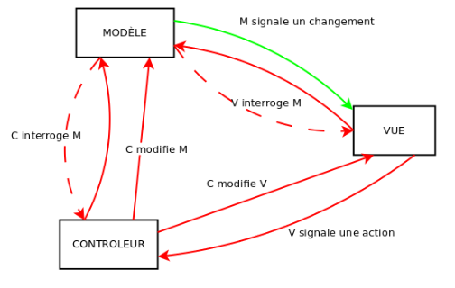
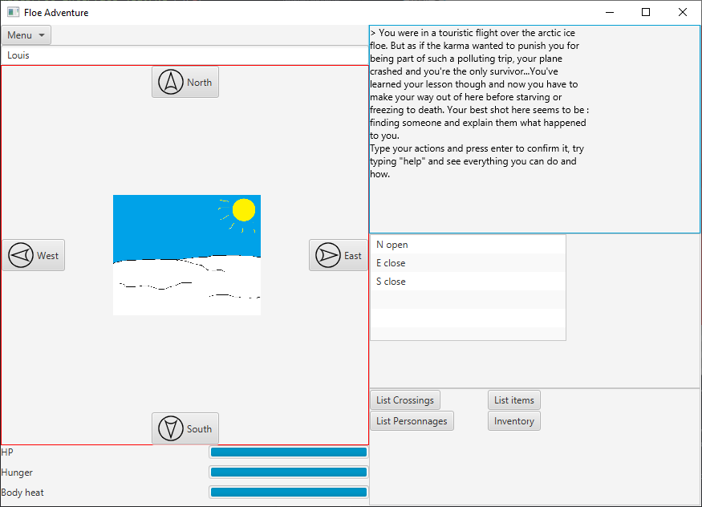

# Projet IHM - Banquise
Ce projet est à réaliser avant le 30 avril 2021, dans le cadre de l'Unité d'Enseignement "Programmation des Interfaces Homme-Machine". Il porte sur la reprise d'un projet proposé dans le cadre de l'Unité d'enseignement "Programmation Orientée Objet" dont les informations sont détaillées dans le fichier `README_POO.md`. Plus particulièrement, ce projet cible le développement d'une interface graphique à partir d'un jeu d'aventure déjà développé.

Composition de notre groupe : Yann Berthelot, Vincent Commin & Louis Leenart.

# Sommaire
- [Installation <a id="installation">](#installation)
    - [Windows <a id="installation_windows">](#installation_windows)
    - [Linux <a id="installation_linux">](#installation_linux)
- [Utilisation <a id="utilisation">](#utilisation)
- [Notre approche de conception en partant de la conception existante <a id="conception">](#conception)
- [Autres points <a id="autres">](#autres)

# Installation

# Utilisation

# Notre approche de conception en partant de la conception existante

### Notre séparation modèle/vue/contrôleur

&nbsp;Pour séparer correctement nos fichiers, nous nous sommes servis de la séparation modèle/vue/contrôleur vu en cours. Nous avons donc géré nos fichiers de la sorte :

<em>Schéma du cours expliquant le MVC (modèle/vue/contrôleur)</em>

- Nos fichiers de base venant du projet de POO étaient ce qui définissait notre jeu, que ce soit les items ou bien le comportement des personnages ainsi que la génération des tuiles. Nous avons donc mis ces fichiers dans le répertoire "modèle".
- Pour la vue, nous y avons mis notre fichier .fxml ainsi que sa classe appelant le fxmlLoader permettant de le charger dans l'application.
- Enfin, pour le contrôleur, nous avons mis la classe liant la vue au modèle.

### Notre interface

&nbsp;Notre jeu étant de base assez basique, nous n'avons pas eu besoin d'une multitude de scènes. Il n'y avait pas d'états particuliers pour les dialogues ou bien les combats, ce qui nous a simplifié la tâche et permis de tout mettre dans la même interface.

<em>Interface imaginée au départ via Lucidchart</em>

<em>Interface rendue du jeu</em>

&nbsp;On peut constater que ces deux interfaces sont quasiment les mêmes à l'exception de l'inventaire et de la sortie des actions. 

&nbsp;A l'origine, l'inventaire devais uniquement être affiché dans la ListeView mais au fil du projet nous en avons décidé autrement. Maintenant, chaque action listant des objets/personnages/passages sont affichés dans la liste. Ceci nous permet en plus d'effectuer des actions sur les objets listés via la méthode OnMouseClicked.

&nbsp;Pareil pour la sortie des actions. On pensait y faire apparaître les points de vie des personnages mais on a préféré garder la description des actions ainsi que la sortie des dialogues.
# Autres points
